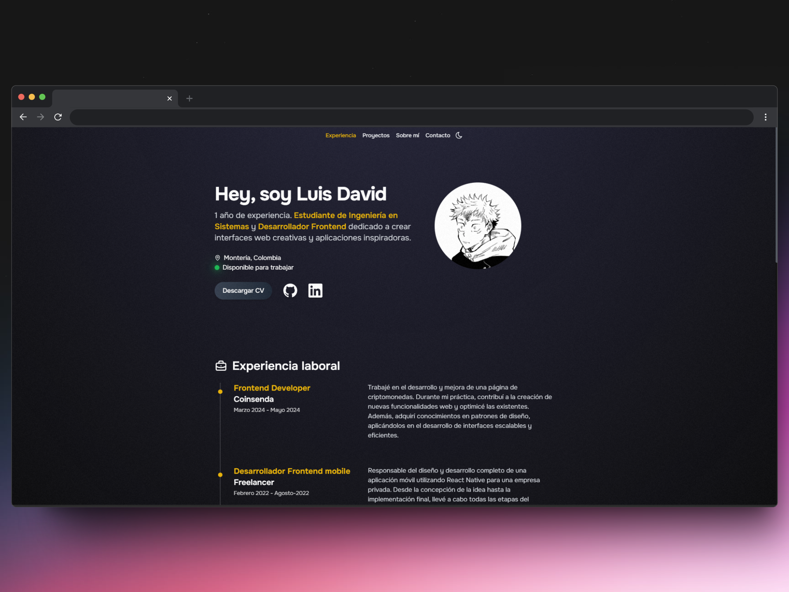

# Bienvenido a mi portfolio!

### Características
- **Astro**: Framework optimizado para sitios rápidos y livianos.
- **Tailwind CSS**: Utilizado para diseñar un estilo moderno y responsivo.
- **Modo oscuro**: Soporte para tema oscuro, adaptándose a las preferencias del usuario.
- **Componentización**: Uso de componentes reutilizables para un código más limpio y mantenible.

Desarrollado con 💻 por Luis David.

Gracias por pasar por aqui, toma un cafecito Dev ☕
